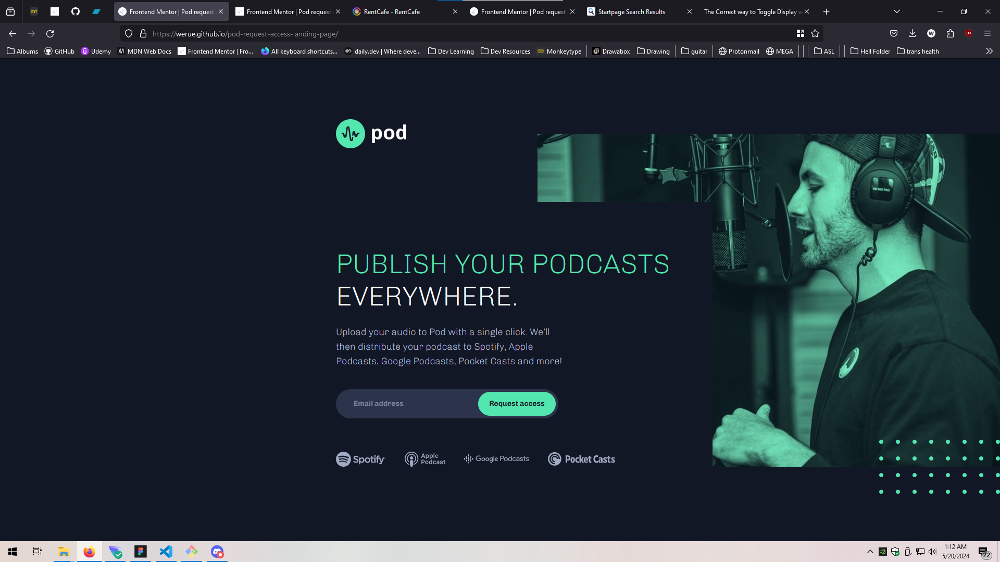

# Frontend Mentor - Pod request access landing page solution

This is a solution to the [Pod request access landing page challenge on Frontend Mentor](https://www.frontendmentor.io/challenges/pod-request-access-landing-page-eyTmdkLSG). Frontend Mentor challenges help you improve your coding skills by building realistic projects. 

## Table of contents

- [Overview](#overview)
  - [The challenge](#the-challenge)
  - [Screenshot](#screenshot)
  - [Links](#links)
- [My process](#my-process)
  - [What I learned](#what-i-learned)
  - [Continued development](#continued-development)
  - [Useful resources](#useful-resources)

**Note: Delete this note and update the table of contents based on what sections you keep.**

## Overview

### The challenge

Users should be able to:

- View the optimal layout depending on their device's screen size
- See hover states for interactive elements
- Receive an error message when the form is submitted if:
  - The `Email address` field is empty should show "Oops! Please add your email"
  - The email is not formatted correctly should show "Oops! Please check your email"

### Screenshot

### Links

- Solution URL: https://www.frontendmentor.io/solutions/pod-landing-page-using-html-css-and-javascript-F-wH6FLsBr
- Live Site URL: https://werue.github.io/pod-request-access-landing-page/

## My process

### What I learned

During this project, I learned about regular expressions and what they are used for. I also learned a little bit about using rems vs. pixels and how they scaled with accessibility settings.

### Continued development

Use this section to outline areas that you want to continue focusing on in future projects. These could be concepts you're still not completely comfortable with or techniques you found useful that you want to refine and perfect.

### Useful resources

Both of these resources introduced me to the notation of regular expressions.

- [Example resource 1](https://www.regular-expressions.info/)
- [Example resource 2](https://developer.mozilla.org/en-US/docs/Web/JavaScript/Guide/Regular_expressions)
